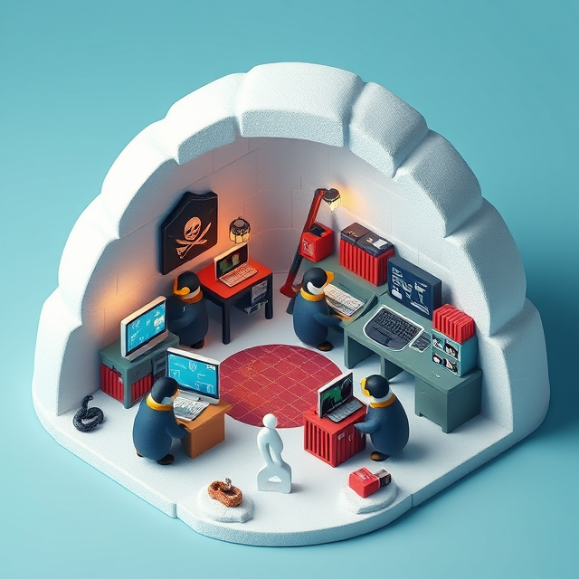

<!-- Title Slide -->
# The Zone: A Modern Data Science Platform

### Empowering Citizen Developers with Open Source

---

<!-- What is The Zone? -->
## What is The Zone?

### Integrated Data Science Platform
- Unified environment: JupyterLab, RStudio, VS Code
- Multi-language support: Python, R, and SAS
- Built on Kubeflow & Kubernetes for scalability

---

<!-- Key Benefits -->
## Key Benefits

### Why Choose The Zone?
- **Cost Efficiency**: Pay only for resources you use
- **Flexibility**: Create workspaces of any size
- **Open Source Foundation**: Eliminate expensive licenses
---

<!-- What is Kubeflow? -->
## What is Kubeflow?

### The Engine Behind The Zone
- Container-based workflow system on Kubernetes
- Simplifies environment creation and experiment tracking
- Enables reproducible data science at scale

---

<!-- Access & Status -->
## Access & Status

### Platform Adoption
- **Access**: https://zone.statcan.gc.ca with enterprise credentials
- **Users**: 2,000+ onboarded, 120+ concurrent daily
- **Performance**: Auto-scaling handles peak loads efficiently

---

<!-- Best Practices -->
## Best Practices

### Optimizing Your Workflow
- **Start Small**: Scale resources as needed to control costs
- **Smart Data**: Use databases instead of copying data
- **Version Control**: Track changes with Git for reproducibility

---

<!-- Tools & Environments -->
## Tools & Environments

### Development Options
- **JupyterLab**: Interactive computing with rich visualizations
- **RStudio**: Dedicated R environment with statistical tools
- **VS Code**: Full-featured editor with multi-language support

---

<!-- SAS Support -->
## SAS Support

### Transition to Open Source
- **Built-in Compatibility**: Run SAS code without expensive licenses
- **Cost Savings**: Reduce licensing fees while preserving investments
- **Migration Path**: Gradual transition to modern open-source tools

---

<!-- Limitations -->
## Limitations

### Current Challenges
- **Legacy Systems**: Performance issues with old SMB shares
- **Learning Curve**: Training needed for containerized environments
- **Resource Planning**: Requires careful allocation for large deployments

---

<!-- Future -->
## Future

### Platform Evolution
- **Pipeline Modernization**: Transforming cronjobs into Kubeflow Pipelines
- **Enhanced Visualization**: New tools for sharing graphical analysis
- **Continuous Innovation**: Expanding capabilities based on user needs
