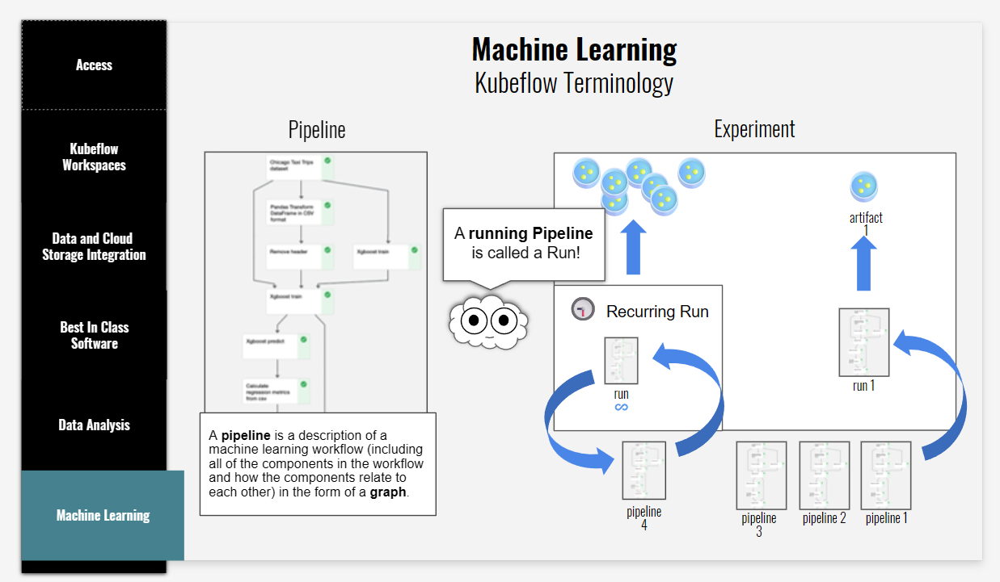

<!-- Title Slide -->
# The Zone: A Modern Data Science Platform

### Enabling Innovation Through Open Source
- Small team, big hearts, big impact
- Power of open source
- Efficient, affordable analytics

---

<!-- Our Story -->
## Our Journey

### From Vision to Reality
- Evolution: The Advanced Analytics Workspace to The Zone
- Born for Protected B analytics
- SAS to Open Source enabler

---

<!-- SAS Migration -->
## SAS Migration

### Bridging Worlds
- SAS alongside Python/R
- JupyterLab's multilingual kernel support
- Only platform enabling this transition

---

<!-- Platform Capabilities -->
## Platform Strengths

### Foundation for Innovation
- Unified environment
- 2,200+ registered users
- 120+ daily notebooks

---
<!-- Technical Expertise -->
## Our Team

### Kubernetes Experts
- CKAD-certified engineers
- Pursuing CKA certification
- Kubeflow is our interface to Kubernetes

---
<!-- Summer Achievements -->
## Summer Progress

### Recent Enhancements
- MKL for accelerated computing
- Tesseract OCR integration
- Volume Cleaner

---

<!-- Future: Kubeflow -->
## Future: Advanced Workflows

### Releasing Kubernetes Power
- Beyond CronJobs to Kubeflow Pipelines
- End-to-end ML pipelines
- Scalable, reproducible workflows

---

## The AAW had Kubeflow Pipelines

---

<!-- Future: Data Access -->
## Future: Enhanced Connectivity

### Breaking Down Data Silos
- Simplified database connections
- Integration
- Sharing

---

<!-- Future: Efficiency -->
## Future: Platform Efficiency

### Optimizing Resources
- Namespace Cleaner
- Code optimizations
- 

---

<!-- Best Practices -->
## Optimization Principles

### Maximizing Value
- Start small, scale as needed
- Connect directly to data
- Build modular, pipeline-ready code
- Version everything

---

<!-- Access & Next Steps -->
## Join the Evolution

### Get Started Today
- Access: https://zone.statcan.gc.ca
- Training & workshops available
- Help shape our future
- Join our growing community
